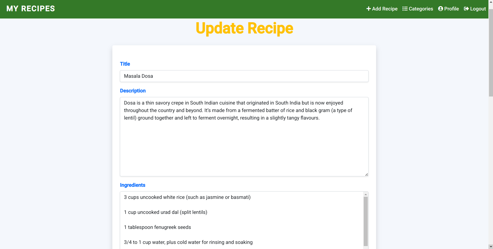

# Recipe App

A Django-based web application that allows users to manage recipes, reviews, and categories. Users can register, log in, add, edit, and delete recipes, as well as reset passwords.

## Features

-   User authentication (register, login, logout)
-   Password reset functionality
-   Profile management
-   Add, update, delete, and view recipes
-   Add, update, delete, and view categories
-   Add reviews to recipes
-   Manage categories (add, update, delete)
-   Responsive design for user-friendly navigation

## Screenshots

Below are some screenshots of the Recipe App:

### Home Page


### Profile Page


### Categories Page


### Add Recipe Page


### Explore Recipes Page


### Recipe Details Page (View 1)


### Recipe Details Page (View 2)


### Login Page


### Register Page


### Edit Profile Page


### Update Recipe Page (View 1)



### Update Recipe Page (View 2)


### Chefs and Newsletter Page


## Project Structure

```
recipe_app/
├── media/                   # Media files (profile pictures, recipes)
├── recipe_app/              # Core app folder
│   ├── __init__.py
│   ├── asgi.py
│   ├── settings.py          # Django settings
│   ├── urls.py              # Core URL configurations
│   ├── wsgi.py
├── recipes/                 # Recipes app
│   ├── migrations/          # Database migrations
│   ├── templates/           # HTML templates
│   ├── admin.py
│   ├── apps.py
│   ├── forms.py             # Form validations
│   ├── models.py            # Database models
│   ├── tests.py
│   ├── urls.py              # Recipes app URLs
│   ├── views.py             # Recipes app views
├── db.sqlite3               # SQLite database
├── manage.py                # Django manage script
```

## Prerequisites

-   Python 3.7+
-   Django 4.0+
-   Pip for managing Python packages
-   SQLite (comes by default with Python)

## Installation

1. Clone the repository:

    ```bash
    git clone https://github.com/imunreal7/recipe-app.git
    cd recipe-app
    ```

2. Create and activate a virtual environment:

    ```bash
    python3 -m venv venv
    source venv/bin/activate  # On Windows: venv\Scripts\activate
    ```

3. Install dependencies:

    ```bash
    pip install -r requirements.txt
    ```

4. Apply migrations:

    ```bash
    python manage.py migrate
    ```

5. Create a superuser:

    ```bash
    python manage.py createsuperuser
    ```

6. Run the development server:

    ```bash
    python manage.py runserver
    ```

7. Access the app in your browser at `http://127.0.0.1:8000`.

## Usage

1. Register as a user and log in.
2. Navigate to the homepage to view or manage recipes.
3. Add, edit, or delete recipes and categories.
4. Reset your password if needed.

## URLs Overview

Here are the main URLs for the application:

-   `/register/` - User registration
-   `/login/` - User login
-   `/logout/` - User logout
-   `/profile/` - View user profile
-   `/profile/edit/` - Edit profile
-   `/add/` - Add a new recipe
-   `/update/<int:pk>/` - Update a recipe
-   `/delete/<int:pk>/` - Delete a recipe
-   `/recipe/<int:id>/` - Recipe details
-   `/recipe/<int:id>/add-review/` - Add a review
-   `/password-reset/` - Reset password
-   `/add-category/` - Add a category
-   `/categories/` - View categories
-   `/categories/<int:category_id>/update/` - Update a category
-   `/categories/<int:category_id>/delete/` - Delete a category

## Contributing

Contributions are welcome! Please open an issue or submit a pull request for any improvements.

## License

This project is licensed under the MIT License. See the LICENSE file for details.

## Author

Aman Dubey

